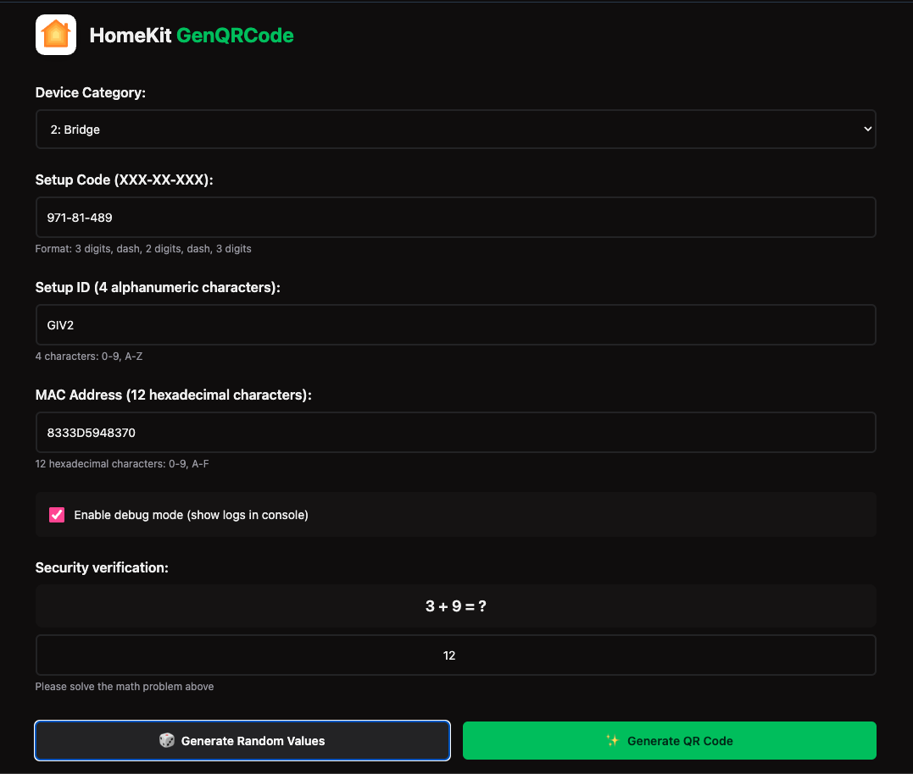

# HomeKitGenQRCode

**Language / Idioma:** [English](README.md) | [Español](README.es.md)

A Go application for generating HomeKit QR code labels with device information.





## Description

Easily generate HomeKit QR code labels for your ESP32 accessories! This Go tool automatically creates print-ready labels including:

- **HomeKit Setup Code** (with QR code) - Scan with iPhone to pair your device
- **Device Code** - Unique identifier for your accessory
- **MAC Address** - Network identifier with barcode
- **Serial Number** - Unique serial with barcode
- **CSN** (Component Serial Number) - Additional identifier with barcode
- **Neatly aligned and aesthetic layout** - Professional appearance matching Apple's HomeKit standards

Perfect for professionally labeling your DIY HomeKit projects built with [HomeSpan](https://github.com/HomeSpan/HomeSpan/).

This tool was created for the [HomeSpan](https://github.com/HomeSpan/HomeSpan/) project, taking inspiration from the original Python implementation by [AchimPieters/esp32-homekit-qrcode](https://github.com/AchimPieters/esp32-homekit-qrcode), but rewritten in Go for better performance, easier distribution, and improved cross-platform compatibility.

## Features

- Generate complete HomeKit QR code labels with all required information
- Support for all HomeKit device categories (Light, Switch, Thermostat, etc.)
- Automatic generation of setup codes, setup IDs, and MAC addresses
- Professional label formatting matching Apple's HomeKit standards
- High-quality QR codes optimized for scanning
- Barcode generation for MAC addresses, serial numbers, and CSNs
- Command-line interface with multiple subcommands
- Single binary executable - no runtime dependencies required

## Installation

### From Source

```bash
git clone https://github.com/lordbasex/HomeKitGenQRCode.git
cd HomeKitGenQRCode
go build ./cmd/homekitgenqrcode
```

### Using Go Install

```bash
go install github.com/lordbasex/HomeKitGenQRCode/cmd/homekitgenqrcode@latest
```

### Web Version (No Installation Required)

Prefer to use the tool directly in your browser? Another option is to use our hosted web version from CNSoluciones - no downloads needed, just generate and you're done!

🌐 **[Use Web Version →](https://cnsoluciones.com/esp32-homekit-qrcode-generator-web/)**

The web version provides the same functionality as the CLI tool, running entirely in your browser with no installation or downloads required. Perfect for quick one-off label generation!

*A Christmas gift from Federico Pereira.*

## Usage

### Quick Start (Recommended)

Generate a QR code label with auto-generated setup code:

```bash
homekitgenqrcode code -c 5 -o example.png
```

### Generate with All Parameters

```bash
homekitgenqrcode generate --category 5 --password "613-80-755" --setup-id "ABCD" --mac "AABBCCDDEEFF" --output example.png
```

### List Available Categories

```bash
homekitgenqrcode list-categories
```

## Commands

### `code` - Auto-generate setup code (Easiest)

Automatically generates setup code, setup ID, and MAC address:

```bash
homekitgenqrcode code -c <category> -o <output.png>
```

Options:
- `-c, --category`: HomeKit category ID (required)
- `-o, --output`: Output image file path (required)
- `-s, --setup-id`: Custom setup ID (optional, auto-generated if not provided)
- `-m, --mac`: Custom MAC address (optional, auto-generated if not provided)

### `generate` - Manual generation

Generate with all parameters manually specified:

```bash
homekitgenqrcode generate -c <category> -p <password> -s <setup-id> -m <mac> -o <output.png>
```

Options:
- `-c, --category`: HomeKit category ID (required)
- `-p, --password`: Setup password in format XXX-XX-XXX (required)
- `-s, --setup-id`: Setup ID: 4 alphanumeric characters (0-9, A-Z) (required)
- `-m, --mac`: MAC address: 12 hexadecimal characters (required)
- `-o, --output`: Output image file path (required)

### `list-categories` - List available categories

Display all available HomeKit device categories:

```bash
homekitgenqrcode list-categories
```

## HomeKit Categories

The following table lists all supported HomeKit device categories with their IDs:

| ID | Category Name |
|----|---------------|
| 1 | Other |
| 2 | Bridge |
| 3 | Fan |
| 4 | Garage Door Opener |
| 5 | Light |
| 6 | Lock |
| 7 | Outlet |
| 8 | Switch |
| 9 | Thermostat |
| 10 | Sensor |
| 11 | Security system |
| 12 | Door |
| 13 | Window |
| 14 | Window covering |
| 15 | Programmable switch |
| 16 | Range extender |
| 17 | IP camera |
| 18 | Video doorbell |
| 19 | Air purifier |
| 20 | Heater |
| 21 | Air conditioner |
| 22 | Humidifier |
| 23 | Dehumidifier |
| 24 | Apple TV |
| 26 | Speaker |
| 27 | Airport |
| 28 | Sprinkler |
| 29 | Faucet |
| 30 | Shower head |
| 31 | Television |
| 32 | Target remote |

**Note:** Category ID 25 is not defined in the HomeKit specification.

## Examples

```bash
# Generate with completely automatic values
homekitgenqrcode code -c 5 -o example.png

# Generate with custom setup ID and MAC
homekitgenqrcode code -c 5 -o example.png -s ABCD -m AABBCCDDEEFF

# Generate in a specific directory (will be created automatically)
homekitgenqrcode code -c 5 -o output/example.png

# Using long flags
homekitgenqrcode generate --category 5 --password "613-80-755" --setup-id "ABCD" --mac "AABBCCDDEEFF" --output example.png
```

## How It Works

1. **Loads the label template** (`assets/qrcode_ext.png`)
2. **Generates a HomeKit setup code** (format: XXX-XX-XXX) or uses provided one
3. **Creates a QR code** following Apple HomeKit standards with proper error correction
4. **Generates device information**:
   - Device Code (category-based format)
   - MAC Address (12 hexadecimal characters)
   - Serial Number (unique alphanumeric pattern)
   - CSN (Component Serial Number)
5. **Positions all elements** aesthetically on the template
6. **Exports a finished label** as a high-resolution PNG file (300 DPI)

Each run creates a unique label with:
- A valid HomeKit setup code
- Unique serial number and CSN
- Auto-generated barcodes (Code 39 format)
- A QR code following Apple HomeKit standards

## Printing

The generated PNG file is ready for printing on white label stickers. The output is optimized at 300 DPI for high-quality printing.

**For best results:**
- Use a laser printer or high-resolution inkjet printer
- Print on white adhesive label paper
- Ensure printer settings match the label size

## Requirements

- Go 1.24.0 or later (only needed for building from source)
- Assets folder with required fonts and template image (included in repository):
  - `SF-Pro-Text-Regular.otf` - Main text font
  - `barcode39.ttf` - Barcode font
  - `qrcode_ext.png` - Label template

**Note:** When using the pre-built binary, no additional dependencies are required!

## License

This project is open source and available for use.

## Contributing

Contributions are welcome! Please feel free to submit a Pull Request.

## Credits

This project was created for [HomeSpan](https://github.com/HomeSpan/HomeSpan/) - a robust Arduino library for creating ESP32-based HomeKit devices.

The original idea and concept came from [AchimPieters/esp32-homekit-qrcode](https://github.com/AchimPieters/esp32-homekit-qrcode), a Python-based QR code generator. This Go implementation provides:

- **Better Performance**: Compiled Go binaries are faster and more efficient than interpreted Python scripts
- **Easier Distribution**: Single binary executable, no Python runtime or dependencies required
- **Cross-Platform**: Works seamlessly on Windows, macOS, and Linux without additional setup
- **Enhanced CLI**: Modern command-line interface using Cobra with auto-completion support

## Integration

This tool is designed to work seamlessly with [HomeSpan](https://github.com/HomeSpan/HomeSpan/), a robust Arduino library for creating ESP32-based HomeKit devices.

**Typical workflow:**
1. Generate your HomeKit QR code label using this tool
2. Print the label and attach it to your ESP32 device
3. Use the setup code and information in your HomeSpan sketch
4. Pair your device with HomeKit using the QR code

## Related Projects

- [HomeSpan](https://github.com/HomeSpan/HomeSpan/) - HomeKit Library for the Arduino-ESP32
- [esp32-homekit-qrcode](https://github.com/AchimPieters/esp32-homekit-qrcode) - Original Python implementation

## Author

**Federico Pereira**

Created with ❤️ by Federico Pereira. This project was developed to make HomeKit QR code label generation easier and more accessible for the DIY HomeKit community.

For questions, suggestions, or contributions, please visit the [GitHub repository](https://github.com/lordbasex/HomeKitGenQRCode).

